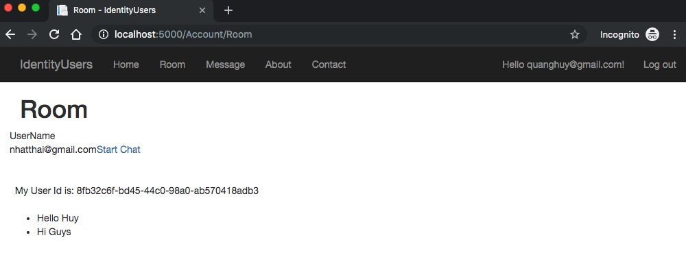
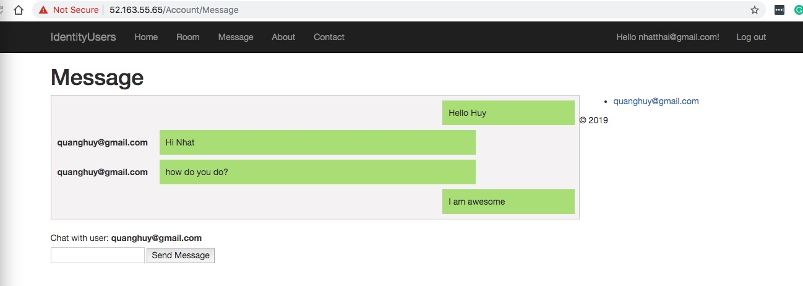
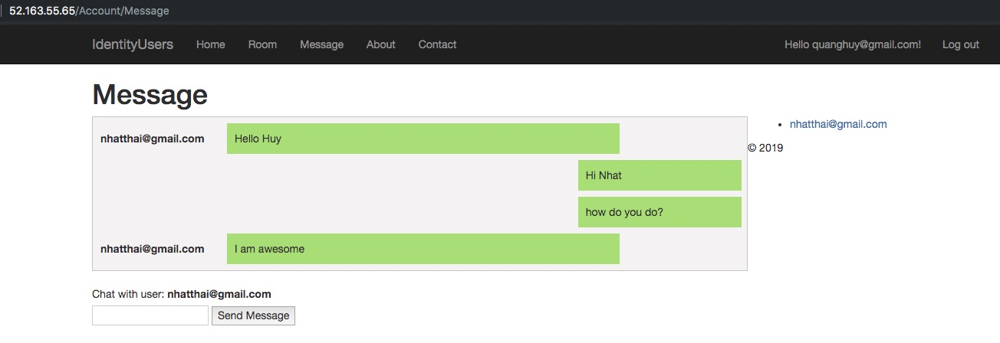

# dotnet-identity-user
ASP.NET Core Razor Pages web apps that use Entity Framework (EF) Core for data access.
+ Razor Pages
+ Unit Testing
+ Data Layer Testing
+ Integration Testing
+ SignalR on local or Azure

### Requirements
+ Docker Compose & Kubernetes
+ ASP NET Core 2.2 & Entity Framework Identity User
+ Sql Server
+ SignR(Chat Message)

### Usage
+ Start Sql Server and Web App
    ```
    cd devops
    docker-compose up
    ```

+ Using Azure SignalR Service
    - Set UseAzureSignalR=true in appsetting.json
    - Set Azure ConnectionString (Endpoint=https://[instant-name].service.signalr.net;AccessKey=[your-key];Version=1.0;)
    ```
    cd src/IndetityUsers
    dotnet user-secrets set Azure:SignalR:ConnectionString "<Your connection string>"
    ```

    - Run app
    ```
    cd src/IndetityUsers
    dotnet build
    dotnet run
    ```

+ Register User & Login (IdentityUser)

+ Send Message

    


+ Receive Message

    

+ Chat Private Message

    

    


### Using Kubernetes on Azure
------------------------------
+ Install helm
+ Intall helm rbac
    ```
    kubectl apply -f helm-rbac.yaml

    helm init --service-account tiller

    helm init --wait
    ```

+ Create Load Balancer on Azure (wait 10 mininutes for public ip address)
    ```
    helm install stable/nginx-ingress \
        --namespace default
        --set controller.replicaCount=2 \
        --set rbac.create=false \
        --set controller.service.externalTrafficPolicy=Local \
        --set controller.nodeSelector."beta\.kubernetes\.io/os"=linux \
        --set defaultBackend.nodeSelector."beta\.kubernetes\.io/os"=linux
    ```


### Reference
+ [Using Azure SignalR Service](https://docs.microsoft.com/en-us/azure/azure-signalr/signalr-quickstart-dotnet-core)
+ [Create an ingress controller in Azure Kubernetes Server(AKS)](https://docs.microsoft.com/en-us/azure/aks/ingress-basic)